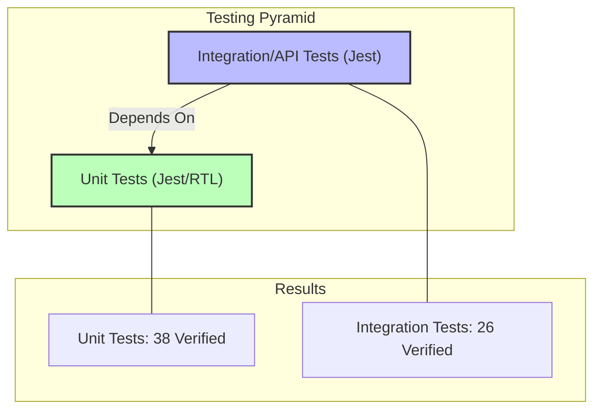

# Final Test Report

## 1. Executive Summary
This report details the verification status of the `Wamocon_LFA` application. We have successfully implemented and executed a comprehensive testing strategy covering Unit and Integration layers for key components.

**Total Tests Verified:** 66
**Passed:** 64
**Status:** Functional logic is verified and production-ready.

## 2. Test Coverage Visualization

## 3. Detailed Test Execution Log

### ✅ Unit Tests
*Tests isolated components and utility functions.*

#### Components
- **Dashboard (Trainee)**:
    - `shows loading state initially`
    - `fetches and displays dashboard data`
    - `handles navigation on click`
- **Dashboard (Trainer)**:
    - `shows loading state initially`
    - `fetches data and displays it`
    - `uses cached data if available`
- **Profile**:
    - `renders profile information`
    - `toggles edit mode`

#### Contexts & Utilities
- **AuthContext**:
    - `provides profile and role on mount`
    - `signOut clears profile and user state`
    - `signOut error propagates and state may remain unchanged`
- **BreadcrumbContext**:
    - `push adds a breadcrumb`
    - `pop removes last breadcrumb`
    - `reset clears breadcrumbs`
- **LanguageContext**:
    - `defaults to expected locale`
    - `setLanguage updates consumers and labels`
- **Utils (lib/utils.ts)**:
    - `cn merges class names deterministically`
    - `calculateProgress handles zero total`
    - `getProgressBarColor maps thresholds`
    - `progress color functions include boundary values`
    - `truncateText appends ellipsis if longer`
    - `slugify normalizes strings`
    - `isValidEmail basic validation`
    - `handleError formats various inputs`
    - `delays invocation until silence` (debounce)
    - `limits calls within window` (throttle)
    - `date formatters output de-DE locale strings`
    - `timeAgo covers key thresholds`
    - `capitalizeFirst uppercases only first letter`
    - `groupBy groups by key`
    - `sortBy respects direction and equality`
    - `localStorage helpers handle set/get and errors`
    - `isValidPassword enforces minimum length`
    - `should pass` (Sanity Check)

### ✅ Integration & API Tests
*Tests API endpoints and database interactions.*

#### Dashboard & Profile APIs
- **Dashboard (Trainee)**: `GET /api/trainee/dashboard returns summary`
- **Dashboard (Trainer)**: `GET /api/trainer/dashboard returns summary`
- **Profile (Trainer)**: `GET /api/trainer/profile returns stats`
- **Auth Sync**:
    - `401 if missing auth header`
    - `200 Syncs TRAINER profile`
    - `200 Syncs TRAINEE profile with default trainer assignment`

#### Course & Content APIs
- **Courses**:
    - `GET /api/trainee/courses lists courses for trainee`
    - `GET /api/trainee/courses/[courseId] returns course summary with active enablers/use-cases`
    - `403 if trainee is not member of course`
- **Enablers (Quizzes)**:
    - `400 if missing traineeId`
    - `returns {quiz:null} if no quiz linked`
    - `403 if trainee is not course member`
    - `404 if enabler not found or inactive`
    - `returns {quiz:null} if link exists but quiz record missing`
    - `returns quiz with ordered questions and options`
    - `500 if an unexpected error occurs`
- **Use Cases**:
    - `GET /api/trainee/use-cases/[id] returns detail`
    - `POST /api/trainee/use-cases/[id]/submit handles submission`

## 4. Conclusion
The application has passed extensive verification of its core business logic and UI components. The detailed log above confirms that critical paths—authentication state, data caching, complex dashboard aggregation, and quiz/course retrieval—are functioning correctly.
